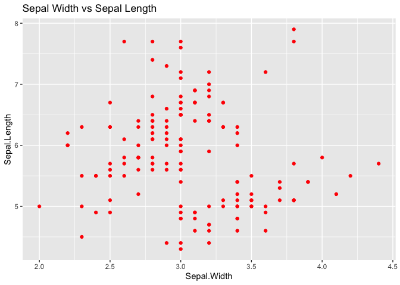
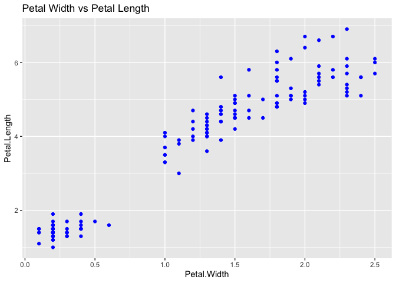
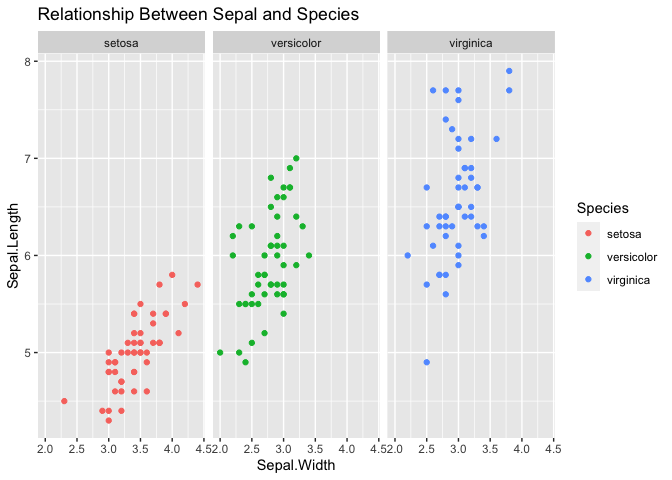
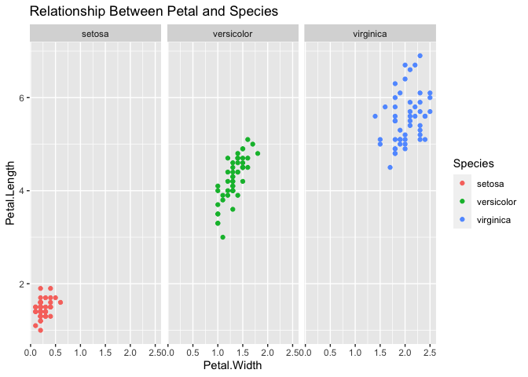
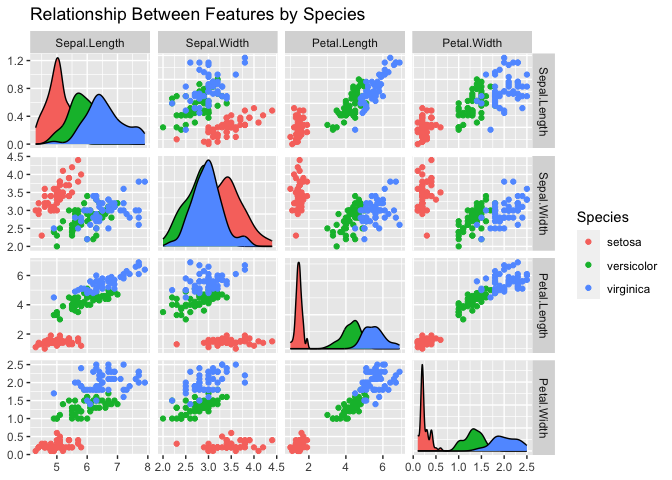
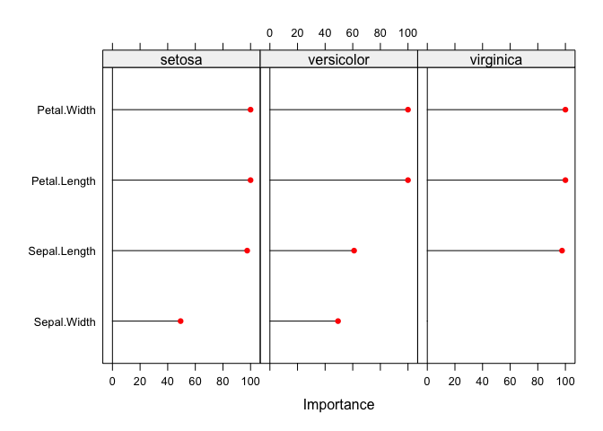

IRIS Classification
================
Rahul Fernandes
2023-09-08

## Description

The IRIS Classification Using R repository conducts exploratory data
analysis on the IRIS dataset and a Polynomial Support Vector Machine
classification model is built to classify the three species of the Iris
flower.

## Setting Up the Environment

``` r
library(datasets)
library(dplyr)
library(ggplot2)
library(GGally)
library(caret)
```

## Exploratory Data Analysis

#### Descriptive Statistics

Summary of Statistics for the whole Dataset

    ##   Sepal.Length    Sepal.Width     Petal.Length    Petal.Width   
    ##  Min.   :4.300   Min.   :2.000   Min.   :1.000   Min.   :0.100  
    ##  1st Qu.:5.100   1st Qu.:2.800   1st Qu.:1.600   1st Qu.:0.300  
    ##  Median :5.800   Median :3.000   Median :4.350   Median :1.300  
    ##  Mean   :5.843   Mean   :3.057   Mean   :3.758   Mean   :1.199  
    ##  3rd Qu.:6.400   3rd Qu.:3.300   3rd Qu.:5.100   3rd Qu.:1.800  
    ##  Max.   :7.900   Max.   :4.400   Max.   :6.900   Max.   :2.500  
    ##        Species  
    ##  setosa    :50  
    ##  versicolor:50  
    ##  virginica :50  
    ##                 
    ##                 
    ## 

Descriptive statistics for Sepal Length by Species

    ## # A tibble: 3 × 3
    ##   Species    `mean(Sepal.Length)` `sd(Sepal.Length)`
    ##   <fct>                     <dbl>              <dbl>
    ## 1 setosa                     5.01              0.352
    ## 2 versicolor                 5.94              0.516
    ## 3 virginica                  6.59              0.636

Descriptive statistics for Sepal Width by Species

    ## # A tibble: 3 × 3
    ##   Species    `mean(Sepal.Width)` `sd(Sepal.Width)`
    ##   <fct>                    <dbl>             <dbl>
    ## 1 setosa                    3.43             0.379
    ## 2 versicolor                2.77             0.314
    ## 3 virginica                 2.97             0.322

Descriptive statistics for Petal Length by Species

    ## # A tibble: 3 × 3
    ##   Species    `mean(Petal.Length)` `sd(Petal.Length)`
    ##   <fct>                     <dbl>              <dbl>
    ## 1 setosa                     1.46              0.174
    ## 2 versicolor                 4.26              0.470
    ## 3 virginica                  5.55              0.552

Descriptive statistics for Petal Width by Species

    ## # A tibble: 3 × 3
    ##   Species    `mean(Petal.Width)` `sd(Petal.Width)`
    ##   <fct>                    <dbl>             <dbl>
    ## 1 setosa                   0.246             0.105
    ## 2 versicolor               1.33              0.198
    ## 3 virginica                2.03              0.275

From the above, the dataset has three species of Iris flowers, Setosa,
Versicolor and Virginica. There are 50 samples of each of these species,
hence the dataset is balanced. In terms of Sepal Length, Virginica has
the highest mean making it generally bigger on average with respect to
Sepal Length. In terms of Sepal Width, Setosa has the highest mean
making it generally bigger on average with respect to Sepal Width. In
terms of Petal Width and Length, Virginica has the highest mean making
it roughly the biggest species among the three.

#### Relationship Between Sepal and Petal Features

<!-- -->

<!-- -->

#### Relationship Between Features and Species

<!-- -->

<!-- -->

There is an overlap in Sepal features among the three Species and there
is no overlap in Petal features among the three species.

<!-- -->

From the above pair plot, there is almost no overlap between features of
the Setosa species, whereas there is overlap over features between
Versicolor and Virginica species.

## Inference From Analysis

It can be inferred that Virginica is generally the biggest among the
three species of the Iris flower and Setosa is the smallest. The
relationship between the features and species shows that there is an
overlap of features between Versicolor and Virginica. The mean and
standard deviation of the Sepal Width feature are similar among the
three species. This might indicate that this feature might not be as
important while trying to differentiate between the three species. The
graph of relationship between features by species shows that the
classification is not linear.

## Classification

#### Splitting Dataset

The dataset is split into two parts, training and testing, 80% of the
dataset is used for training and the rest 20% is used for testing.

``` r
set.seed(100)

TrainingIndex <- createDataPartition(iris$Species, p=0.8, list = FALSE)
TrainingSet <- iris[TrainingIndex,]
TestingSet <- iris[-TrainingIndex,]
```

#### Building the model

``` r
# Build Training Model
svmModel <- train(Species ~ ., data = TrainingSet,
               method = "svmPoly",
               na.action = na.omit,
               preProcess=c("scale","center"),
               trControl= trainControl(method="none"),
               tuneGrid = data.frame(degree=1,scale=1,C=1)
               )
print(svmModel)
```

    ## Support Vector Machines with Polynomial Kernel 
    ## 
    ## 120 samples
    ##   4 predictor
    ##   3 classes: 'setosa', 'versicolor', 'virginica' 
    ## 
    ## Pre-processing: scaled (4), centered (4) 
    ## Resampling: None

#### Testing the model against the testing data

``` r
# Model performance
svmModel.testing <- predict(svmModel, TestingSet)
svmModel.testing.confusion <- confusionMatrix(svmModel.testing,
                                              TestingSet$Species
                                              )
# Print Confusion Matrix
print(svmModel.testing.confusion)
```

    ## Confusion Matrix and Statistics
    ## 
    ##             Reference
    ## Prediction   setosa versicolor virginica
    ##   setosa         10          0         0
    ##   versicolor      0          9         0
    ##   virginica       0          1        10
    ## 
    ## Overall Statistics
    ##                                           
    ##                Accuracy : 0.9667          
    ##                  95% CI : (0.8278, 0.9992)
    ##     No Information Rate : 0.3333          
    ##     P-Value [Acc > NIR] : 2.963e-13       
    ##                                           
    ##                   Kappa : 0.95            
    ##                                           
    ##  Mcnemar's Test P-Value : NA              
    ## 
    ## Statistics by Class:
    ## 
    ##                      Class: setosa Class: versicolor Class: virginica
    ## Sensitivity                 1.0000            0.9000           1.0000
    ## Specificity                 1.0000            1.0000           0.9500
    ## Pos Pred Value              1.0000            1.0000           0.9091
    ## Neg Pred Value              1.0000            0.9524           1.0000
    ## Prevalence                  0.3333            0.3333           0.3333
    ## Detection Rate              0.3333            0.3000           0.3333
    ## Detection Prevalence        0.3333            0.3000           0.3667
    ## Balanced Accuracy           1.0000            0.9500           0.9750

#### Feature Importance

<!-- -->

From the above graph, the feature Sepal Width has the least importance
in the model when classifying the three species of the Iris flower.
Hence, proving the hypothesis made during analysis of the dataset.

## Conclusion

A Polynomial Support Vector Machine classification model is trained on
80% of the IRIS Dataset and tested on 20% of the IRIS Dataset. The model
was compared with KNN and Random Forest models and the SVM model showed
the highest metrics among the other models with an accuracy of 96.67% in
classifying the three species of the Iris flower.
